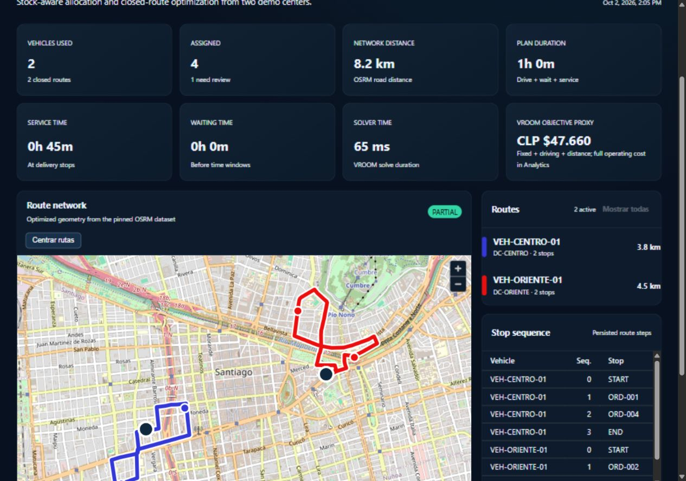
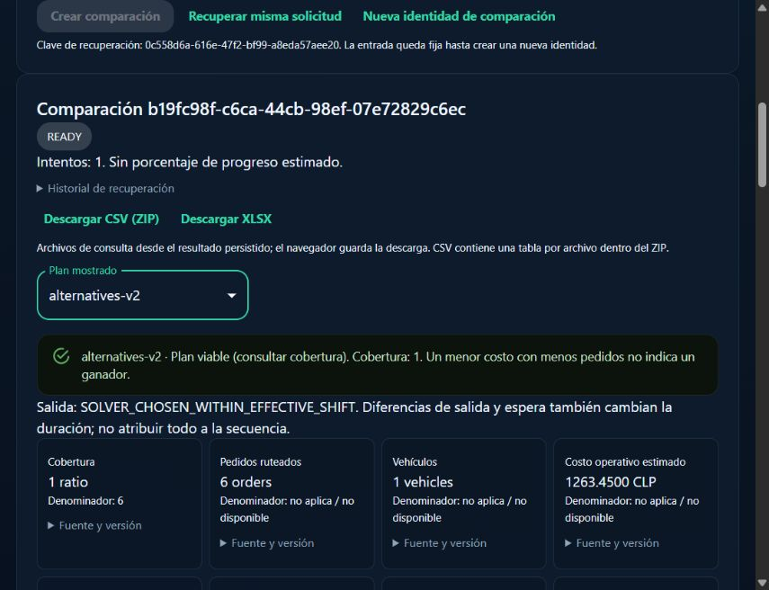
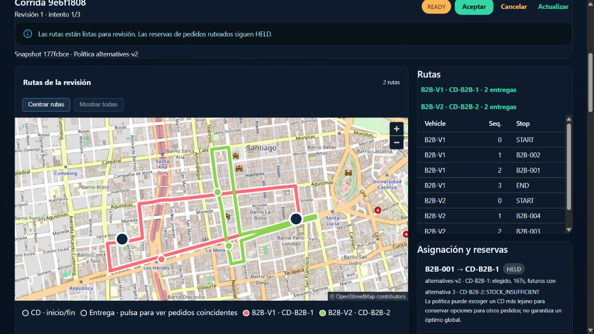

# RouteOps

**Inventory-aware delivery planning with traceable decisions and comparable route plans.**

RouteOps addresses a dispatch problem: which distribution center can cover an
entire order, which vehicle can carry it, and what route can serve it within the
available hours? It combines inventory allocation, transactional reservations
and road routing, then explains the routes and exclusions. All demonstration
orders, stock and business identifiers are synthetic.

> **Status:** Milestones 1–3 and the `v0.2.1` corrections are complete and accepted.
> Milestone 3 (`v0.3.0`), accepted on 2026-10-03, adds constraints, estimated
> operating costs, KPIs, diagnostics, manual comparisons and exports.
> [Acceptance and evidence](docs/milestone-3-final-review.md) distinguish browser,
> API, automated and independent-reader checks. Delivery 4.1 (quality/CI) was
> closed and published on 2026-10-04. Delivery 4.2 (performance/basic security) is
> closed and published for local single-user use. Delivery 4.3 implements the
> runbooks and portfolio tours and is **pending review** on its branch;
> `v0.4.0` has not been created.



## Capabilities

- Import exactly five CSV datasets or one XLSX workbook; validate structure,
  relationships, daily planning context and optional geographic coverage.
- Publish immutable revisions with hashes and record provenance. Original files
  remain private, with no download endpoint.
- Assign each complete order to one CD. Auditable `alternatives-v2` considers
  future alternatives; `greedy-v1` remains available. Neither guarantees a global optimum.
- Reserve stock atomically, accounting separately for external reservations,
  safety stock and RouteOps reservations. Accept or cancel recoverable runs
  without losing history.
- Route with real OSRM/VROOM: capacity, skills, windows, service, shifts, closed
  routes and optional distance, driving-time and task limits.
- Inspect sequences, candidates, reservations and diagnostics with explicit
  `PROVEN`/`INFERRED` certainty and primary/supplementary roles.
- Compare an exact manual sequence against optimized alternatives using one
  frozen context. Analytical comparisons do not create operational reservations.
- Read versioned KPIs, utilization by dimension and processing measurements;
  download matching CSV tables in a ZIP or XLSX from persisted results.

### B2B and B2C examples

Both models share explicit contracts. Labels activate no hidden business rules:
capacities, skills, windows and limits come from the dataset.

| Synthetic case | Demonstration |
|---|---|
| `b2b-feasible` | Two business deliveries, service time and a viable manual baseline. |
| `b2b-diagnostics` | Independent stock, fleet, capacity and temporal exclusions. |
| `b2c-feasible` | Six parcel deliveries, shared coordinates, KPIs and comparison. |
| `b2c-task-pressure` | Six orders against a two-task limit; individual omission causes remain inferred. |
| `b2c-distance-inferred` | Tight distance/driving limits without attributing a proven individual cause. |
| Portfolio B2B | Four deliveries, two trucks/two CDs, weight, cold skills and service. |
| Portfolio B2C | Six distinct destinations, two vans, windows and task caps. |

The original `ORD-003` regression remains: it needs 20 units of `SKU-C`, but each
CD has only five available after safety stock. `STOCK_NO_FULL_COVERAGE` is intentional.



These are real browser captures of synthetic local scenarios. Extensive evidence
stays outside the repository. See [final review coverage](docs/milestone-3-final-review.md).



The new [portfolio tour](docs/portfolio-tour.md) uses isolated scenarios. Its
[candidate report](docs/milestone-4-3-portfolio.md) separates API, browser,
independent-reader and automated evidence.

## Architecture and stack

```text
React + MUI + MapLibre workspaces
              |
         FastAPI API
              |
application services and domain policies
       |                         |
PostgreSQL/PostGIS          SolverGateway → VROOM → OSRM
revisions, inventory,             road costs and geometry
history and leased workers
```

- **Backend:** Python 3.14, FastAPI, SQLAlchemy, Alembic, Decimal business costs.
- **Persistence:** PostgreSQL 18/PostGIS 3.6; immutable snapshots and evidence,
  constraints, stable lock ordering and PostgreSQL-coordinated leased work.
- **Routing:** pinned VROOM **1.15.0**, OSRM **26.9.0**, bounded Santiago OSM extract
  with checksum metadata. VROOM is used exclusively through `SolverGateway`.
- **Frontend:** React, TypeScript, Vite, MUI and MapLibre; Node 24 tooling.
- **Runtime:** Docker Compose, private storage, loopback-bound ports, dependency
  locks and image digests. Workers handle validation, planning, comparisons and maintenance.

The modular backend separates solver contracts from adapter JSON and persistence.
An existing revision-preparation module still reads ORM models directly; this
boundary limitation is recorded in the [architecture](docs/architecture.md).

## Quick start

Prerequisites: Docker Engine/Desktop with Linux containers, Compose >=2.24.4
and Python 3.14.7. Windows examples use PowerShell; database targets
`linux/amd64`. See [Windows/WSL2/Linux operations](docs/local-runbook.md)
for an isolated clean checkout and paired backup/restore.

From the repository root:

```powershell
# New installation only; never overwrite an existing .env:
Copy-Item .env.example .env
# Edit .env: choose POSTGRES_PASSWORD and set ROUTEOPS_DATABASE_URL with
# the same password, URL-encoding reserved characters. The database host
# inside Compose is database:5432.
python scripts/ci/prepare_map.py --destination data/osrm/santiago-demo.osm
docker compose --profile tools run --rm osrm-prepare
docker compose up -d --build
Invoke-RestMethod http://127.0.0.1:8000/health/ready
```

Keep `.env` private and untracked. The template contains no database password;
Compose rejects missing required values. Downloaded OSM/OSRM artifacts are
ignored. The tracked gzip restores the exact accepted source after checking
packed/expanded hashes against [source-lock.json](data/osrm/source-lock.json).
Download scripts are for deliberate dataset refresh, not exact reproduction.

| Workspace | Local URL |
|---|---|
| Original dashboard | <http://127.0.0.1:5173/> |
| Imports | <http://127.0.0.1:5173/imports> |
| Planning and reservations | <http://127.0.0.1:5173/planning> |
| KPIs and diagnostics | <http://127.0.0.1:5173/analytics> |
| Manual comparisons | <http://127.0.0.1:5173/comparisons> |
| OpenAPI | <http://127.0.0.1:8000/docs> |
| Readiness | <http://127.0.0.1:8000/health/ready> |

Run the original live-service check in a second terminal:

```powershell
./scripts/smoke.ps1
```

Stop with `docker compose down` to retain named volumes and local history.
Do not add `--volumes` when retaining data.

### Demonstration tour

1. Run optimization on the original dashboard: blue `#3338d6` and red `#eb1010`
   routes, four deliveries and the deliberate `ORD-003` exception.
2. In **Imports**, download templates, upload a package, set date, daily horizon,
   IANA zone and currency, validate, then publish. `VALID` and `PUBLISHED` differ.
3. In **Planning**, select a revision or prepare an isolated allocation demo:
   exclusive stock, eligible centers, shared/restricted stock or fleet restrictions.
   Inspect candidates and `HELD` reservations before accepting (`CONFIRMED`) or
   canceling (`RELEASED`).
4. In **Analytics**, read costs, KPIs and diagnoses. Missing historical facts
   remain explicitly unavailable.
5. In **Comparisons**, enter vehicle, CD and ordered IDs. Compare both policies
   and download persisted facts. Departure times and waiting affect deltas;
   a cheaper incomplete plan is not declared a winner.

Generate the new two-vehicle portfolio input outside the repository:

```powershell
docker compose exec backend python -m routeops.infrastructure.data.portfolio_cases --model b2c --format xlsx --output /tmp/routeops-b2c-demo
docker compose cp backend:/tmp/routeops-b2c-demo ../routeops-b2c-demo
```

The output directory must be empty; existing files are preserved. Upload the
workbook with date **2026-10-15**, horizon **08:00–18:00**, zone
**America/Santiago**, offset **−03:00** and currency **CLP**. The generator also
supports `--model b2b --format csv`. Upload only the five CSV or workbook, not
`context.json`. See [the tour](docs/portfolio-tour.md) for exact manual sequences,
API commands and expected outcomes. Historical cases retain their separate
`operation_cases` generator and [definitions](docs/milestone-3-1c-diagnostics.md).

## Tests and evidence

Final 3.3 records contain **332 backend tests** (213 unit, 119 integration) and
**36 frontend tests**, plus Ruff, strict mypy, TypeScript, Vite build, Compose
and migration checks. Integrations use real PostgreSQL/PostGIS and OSRM/VROOM.
Browser observations and independent export readers are separate in the
[3.3 report](docs/milestone-3-3-analytics-exports.md). These are local results;
Accepted Delivery 4.1 adds the [GitHub Actions quality workflow](.github/workflows/quality.yml)
and [local/CI runbook](docs/milestone-4-1-quality-ci.md). Its functional commit
`f7582f0` passed all three CI jobs, including 332 backend and 36 frontend tests.
Three identified local check resources await cleanup after a recorded policy
rejection; this does not condition the authorized technical closure.
Its execution status and downloadable reports are available in
[GitHub Actions](https://github.com/ErosIgnacio/routeops-platform/actions/workflows/quality.yml).

The 4.3 functional commit `9b1c889` passed [CI 37391351227](https://github.com/ErosIgnacio/routeops-platform/actions/runs/37391351227):
264 unit + 121 integration backend tests, 36 frontend tests, nine CI-tool,
four review safeguards and three Node boundary contracts, plus real smoke and
both new portfolio tours. A BuildKit EOF before integration was resolved by
retrying only the failed job. Final documentation commit CI is recorded in
the external candidate manifest. Previous benchmark measurements retain their
original commit/runtime provenance; 4.3 adds no capacity benchmark.

For unit/static checks with Python 3.14 and Node 24:

```bash
cd backend
python -m pip install -r requirements-dev.lock.txt
ruff check src tests
mypy src
pytest -m "not integration"
```

```bash
cd frontend
npm ci --ignore-scripts
npm test -- --run
npx tsc --noEmit
npm run build
```

For integration configuration, migrations and live-service checks, follow the
[integrated acceptance runbook](docs/milestone-2-6-acceptance.md) and 3.3 report.
Host execution uses loopback service addresses; Compose uses service names.

## Documentation

| Topic | Document |
|---|---|
| Product, architecture and data | [Requirements](docs/product-requirements.md), [architecture](docs/architecture.md), [data model](docs/data-model.md) |
| Imports and solver contracts | [Data contracts](docs/data-contracts.md), [optimization contract](docs/optimization-contract.md) |
| Constraints and cost mapping | [3.1a](docs/milestone-3-1a-contracts-costs.md) |
| KPIs and processing-time boundaries | [3.1b](docs/milestone-3-1b-metrics.md) |
| Diagnostic certainty and fixtures | [3.1c](docs/milestone-3-1c-diagnostics.md) |
| Manual baseline and frozen context | [3.2](docs/milestone-3-2-plan-comparison.md) |
| Analytics, UI and safe exports | [3.3](docs/milestone-3-3-analytics-exports.md) |
| Final coverage and acceptance | [Hito 3 acceptance](docs/milestone-3-final-review.md) |
| Previous published acceptance | [Hito 2](docs/milestone-2-6-acceptance.md), [v0.2.1](docs/v0.2.1-routing-ui.md) |
| Install, operate and restore | [Windows/WSL2/Linux](docs/local-runbook.md), [API](docs/api.md) |
| Portfolio and closure | [Tour](docs/portfolio-tour.md), [4.3 report](docs/milestone-4-3-portfolio.md), [checklist](docs/milestone-4-closure-checklist.md) |
| Third-party terms | [Notices](THIRD_PARTY_NOTICES.md), [inventory](docs/research/m43-license-inventory.json) |
| Remaining work | [Roadmap](docs/roadmap.md) |

## Current limits and Milestone 4

- Trusted local use only: authentication and production deployment are pending;
  no external upload access is enabled.
- Results are estimated plans, not executed deliveries or realized savings.
  Decimal operating cost and VROOM's integer objective have different scopes.
- A whole order comes from one CD; there is no global-optimum guarantee.
  All vehicle types currently use one OSRM `car` profile.
- Defaults: 20 orders, 60 lines, six vehicles, 80 CD–order allocation cells and
  1,024 routing matrix cells. Workload checks precede reservations. These are
  separate from import limits; local samples establish no maximum throughput.
- Durable commit acknowledgment may be unknown. Missing intervals and historical
  departure metadata are not invented.
- CSV readers must preserve identifiers as text; XLSX stores inert text cells.
  Independent readers were checked, not native Excel or every browser/device.
- Frontend bundle and Starlette/httpx warnings remain documented.

**Milestone 4:** quality/CI (4.1) is technically accepted. Reproducible performance
and basic security (4.2) is technically accepted for local single-user use;
final runbooks, backup/reset guidance
and portfolio preparation (4.3) remain pending.
No separate RouteEngine is introduced in this delivery.
See [4.2 measurements and security boundaries](docs/milestone-4-2-performance-security.md).
The [accepted image review](docs/milestone-4-2-image-security-review.md) records
exact digests, distribution backports, bundled components and residual findings.
The VROOM wrapper now has a local HTTP guard and a pinned supported Node runtime;
the solver, routing profile and dataset are preserved. Outstanding advisories
are documented rather than suppressed; this remains a local single-user system.
Performance samples are the baseline from `88f5398`, before the final XLSX/HTTP
mitigations and Node replacement. They do not establish performance of the
corrected runtime or production capacity. The policy-blocked local cleanup from
4.1 remains recorded in the delivery reports and does not condition acceptance.

## License and map attribution

Code: [Apache-2.0](LICENSE). Dependency and map terms:
[THIRD_PARTY_NOTICES.md](THIRD_PARTY_NOTICES.md). Maps retain
`© OpenStreetMap contributors`; OSM data is subject to ODbL. Public raster tiles
serve low-volume local demonstrations, not production traffic. Do not add real
customer addresses, credentials or business inventory to this repository.
